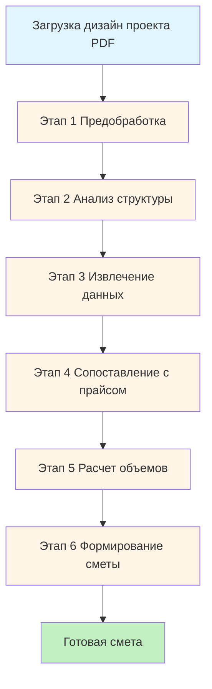

# Методология и алгоритм AI-генерации смет из дизайн-проектов

## Часть 1: Методология составления смет (для человека)

### 1.1 Предварительный анализ дизайн-проекта

**Шаг 1: Изучение структуры проекта**

- Определить количество и типы документов (планировки, развертки стен, спецификации, 3D-визуализации)
- Выявить все помещения и их назначение
- Зафиксировать общую площадь объекта и площади отдельных помещений
- Определить высоту потолков

**Шаг 2: Сбор метрических данных**

- Измерить площади полов для каждого помещения
- Вычислить площади стен (за вычетом проемов)
- Вычислить площади потолков
- Зафиксировать длины периметров для плинтусов, багетов
- Измерить площади и размеры оконных и дверных проемов
- Определить длины трасс коммуникаций (электрика, водоснабжение, канализация)

**Шаг 3: Анализ существующего состояния и объема демонтажа**

- Определить что нужно демонтировать (стены, перегородки, полы, отделка)
- Оценить объемы вывоза мусора
- Выявить необходимость усиления конструкций

### 1.2 Детальный анализ работ по разделам

**Раздел: Подготовительные работы**

- Защита существующих конструкций
- Демонтажные работы
- Вывоз мусора и уборка
- Грунтовка поверхностей

**Раздел: Стены и перегородки**

- Возведение новых перегородок (материал, площадь)
- Выравнивание стен (штукатурка/гипсокартон, площадь)
- Шпаклевка и финишная подготовка
- Укладка плитки (площадь, размер плитки)
- Поклейка обоев (площадь, тип обоев)
- Покраска (площадь, количество слоев)

**Раздел: Полы**

- Демонтаж старых покрытий
- Стяжка (объем, толщина)
- Гидроизоляция (площадь)
- Теплый пол (площадь, тип системы)
- Укладка напольного покрытия (ламинат/плитка/паркет, площадь)
- Монтаж плинтусов (длина)

**Раздел: Потолки**

- Выравнивание базового потолка
- Натяжные потолки (площадь, количество уровней)
- Подвесные потолки из ГКЛ (площадь, количество уровней)
- Покраска потолков (площадь)
- Монтаж багетов и карнизов (длина)

**Раздел: Электромонтажные работы**

- Штробление стен под проводку (длина)
- Прокладка кабелей (длина, сечение)
- Установка подрозетников (количество)
- Установка розеток и выключателей (количество, тип)
- Установка светильников (количество, тип)
- Монтаж электрощита (количество)

**Раздел: Сантехнические работы**

- Разводка водоснабжения (длина, диаметр труб)
- Разводка канализации (длина, диаметр)
- Установка сантехнических приборов (ванна, душ, унитаз, раковины - количество)
- Установка смесителей и аксессуаров (количество)
- Подключение водонагревателя, стиральной машины

**Раздел: Двери и окна**

- Установка межкомнатных дверей (количество, размеры)
- Установка фурнитуры (ручки, замки)
- Отделка откосов (площадь)
- Установка подоконников (длина)

**Раздел: Дополнительные работы**

- Вентиляция и кондиционирование
- Установка встроенной мебели
- Установка карнизов для штор
- Монтаж декоративных элементов

### 1.3 Сопоставление с прайс-листом

**Шаг 1: Поиск позиций**

- Для каждой работы найти соответствующую позицию в прайс-листе
- При отсутствии точного совпадения искать аналоги
- Учитывать единицы измерения

**Шаг 2: Определение цен**

- Зафиксировать розничную цену (для заказчика)
- Определить закупочную цену (для мастера)
- Учесть коэффициенты сложности работ

**Шаг 3: Расчет количества материалов**

- Рассчитать с учетом коэффициента запаса (обычно +10-15%)
- Учесть особенности монтажа (резка, подгонка)

### 1.4 Формирование итоговой сметы

**Структура сметы:**

1. Группировка по разделам (логическая последовательность работ)
2. Внутри раздела — последовательность от подготовки к финишу
3. Для каждой позиции: номер, наименование, единица измерения, количество, цена, сумма
4. Итоги по разделам
5. Общий итог

**Проверка:**

- Не упущены ли какие-то работы
- Корректность расчетов
- Соответствие реалиям объекта

---

## Часть 2: Алгоритм AI-генерации смет

### Общая архитектура системы

Учитывая, что ИИ не может за раз обработать весь дизайн-проект (сотни изображений, большие объемы данных), необходимо разбить процесс на **микрозадачи**, выполняемые последовательно или параллельно.

### Этап 1: Предобработка PDF (программно)

**Микрозадача 1.1: Разбор PDF**

- Извлечь все страницы из PDF
- Определить типы страниц (текст, изображение, смешанный)
- Конвертировать страницы в изображения оптимального размера (для ИИ)

**Микрозадача 1.2: Классификация страниц (ИИ)**

- Отправить превью всех страниц (миниатюры) одним запросом к ИИ
- ИИ классифицирует каждую страницу по типу:
- Обложка/титульный лист
- План помещения с размерами
- Развертка стен
- Спецификация материалов
- Узлы и детали
- 3D-визуализация
- Прочее

**Микрозадача 1.3: Группировка страниц (программно)**

- Создать группы страниц по типам
- Определить приоритетность обработки (планы > развертки > спецификации > визуализации)

### Этап 2: Анализ структуры проекта (ИИ)

**Микрозадача 2.1: Извлечение общей информации**

- Отправить ИИ титульный лист и первые страницы
- Извлечь: общую площадь, адрес объекта, количество комнат, высоту потолков
- Сохранить в структурированном формате JSON

**Микрозадача 2.2: Анализ планировки**

- Отправить ИИ все страницы с планами (по одной или группами)
- Извлечь для каждого помещения:
- Название помещения
- Площадь
- Размеры (длина/ширина)
- Назначение (жилая, санузел, кухня, коридор и т.д.)
- Сохранить структуру помещений в JSON

**Микрозадача 2.3: Выявление конструктивных изменений**

- ИИ анализирует планы до/после (если есть)
- Определяет:
- Демонтаж перегородок
- Возведение новых перегородок
- Перенос дверных проемов
- Площади и объемы работ по демонтажу

### Этап 3: Извлечение данных по помещениям (ИИ + программные расчеты)

Обрабатываем каждое помещение отдельно.**Микрозадача 3.1: Анализ разверток стен (ИИ)**

- Для каждого помещения отправить ИИ развертки стен
- ИИ извлекает:
- Материалы отделки стен (плитка, обои, краска)
- Размеры облицовки
- Расположение розеток, выключателей
- Наличие ниш, выступов
- Размеры и количество дверных/оконных проемов

**Микрозадача 3.2: Расчет площадей стен (программно)**

- На основе данных из планов и разверток
- Рассчитать площади стен для каждого вида отделки
- Вычесть площади проемов
- Учесть коэффициенты сложности

**Микрозадача 3.3: Анализ полов (ИИ)**

- ИИ анализирует планы полов
- Извлекает:
- Тип напольного покрытия по зонам
- Наличие теплого пола
- Необходимость стяжки
- Плинтусы

**Микрозадача 3.4: Расчет объемов полов (программно)**

- Рассчитать площади для каждого типа покрытия
- Рассчитать объем стяжки (площадь × толщина)
- Рассчитать длину плинтусов (периметр помещения)

**Микрозадача 3.5: Анализ потолков (ИИ)**

- ИИ анализирует планы потолков
- Извлекает:
- Тип потолка (натяжной, ГКЛ, покраска)
- Количество уровней
- Расположение светильников

**Микрозадача 3.6: Расчет площадей потолков (программно)**

- Рассчитать площади для каждого типа отделки
- Учесть площади разных уровней

### Этап 4: Анализ коммуникаций (ИИ)

**Микрозадача 4.1: Электрика**

- ИИ анализирует электрические схемы и развертки
- Подсчитывает:
- Количество розеток (по типам)
- Количество выключателей
- Количество светильников (по типам)
- Примерную длину кабельных трасс

**Микрозадача 4.2: Сантехника**

- ИИ анализирует сантехнические планы
- Определяет:
- Расположение сантехприборов
- Длину трубопроводов водоснабжения
- Длину канализационных труб
- Количество и типы приборов

**Микрозадача 4.3: Вентиляция и кондиционирование**

- ИИ находит схемы вентиляции (если есть)
- Определяет количество вентиляционных каналов, решеток

### Этап 5: Извлечение спецификаций материалов (ИИ)

**Микрозадача 5.1: Парсинг таблиц спецификаций**

- ИИ находит страницы со спецификациями
- Извлекает структурированные данные:
- Наименование материала
- Артикул/бренд
- Единица измерения
- Количество
- Примечания

**Микрозадача 5.2: Сопоставление с визуальными данными**

- Если материал указан на развертке, но нет в спецификации — добавить
- Проверить консистентность данных

### Этап 6: Предобработка прайс-листа (ИИ + программно)

**Микрозадача 6.1: Парсинг прайс-листа (программно)**

- Загрузить Google Таблицу через API
- Извлечь все строки и колонки
- Определить структуру (где названия работ, где цены, где единицы измерения)

**Микрозадача 6.2: Индексирование прайс-листа (ИИ)**

- ИИ анализирует прайс-лист
- Создает индекс категорий работ:
- Демонтажные работы
- Штукатурка и шпаклевка
- Плитка
- Полы
- Потолки
- Электрика
- Сантехника
- И т.д.
- Создает эмбеддинги (векторные представления) для каждой позиции прайс-листа

### Этап 7: Сопоставление работ с прайс-листом (ИИ)

Обрабатываем каждый раздел работ отдельно.**Микрозадача 7.1: Определение необходимых работ для помещения**

- Для каждого помещения ИИ составляет список необходимых работ на основе:
- Типа помещения
- Извлеченных данных о отделке
- Стандартной последовательности работ

**Микрозадача 7.2: Поиск позиций в прайс-листе (ИИ + семантический поиск)**

- Для каждой необходимой работы:
- Выполнить семантический поиск по индексу прайс-листа
- ИИ выбирает наиболее подходящую позицию
- Если точного совпадения нет — предлагает аналог
- Извлекает цену (розничную и закупочную если есть)

**Микрозадача 7.3: Расчет себестоимости**

- Если в прайс-листе нет закупочной цены:
- Применить коэффициент (например, 70% от розничной)
- Или попросить ИИ оценить на основе типа работы

### Этап 8: Расчет объемов и формирование сметы (программно + ИИ)

**Микрозадача 8.1: Программный расчет объемов**

- Взять извлеченные метрические данные (площади, длины)
- Умножить на количество работ
- Применить коэффициенты запаса

**Микрозадача 8.2: ИИ-верификация объемов**

- ИИ проверяет реалистичность рассчитанных объемов
- Сравнивает с типовыми значениями
- Предупреждает о возможных ошибках

**Микрозадача 8.3: Группировка по разделам (программно)**

- Сгруппировать все позиции по логическим разделам:
- Подготовительные работы
- Демонтаж
- Стены
- Полы
- Потолки
- Электрика
- Сантехника
- Двери и окна
- Прочее

**Микрозадача 8.4: Сортировка внутри разделов**

- Упорядочить работы в правильной последовательности
- Присвоить номера позициям

**Микрозадача 8.5: Расчет итогов**

- Рассчитать итоги по каждому разделу
- Рассчитать общий итог
- Сформировать JSON структуру сметы

### Этап 9: Постобработка и контроль качества (ИИ)

**Микрозадача 9.1: Проверка полноты (ИИ)**

- ИИ анализирует итоговую смету
- Проверяет не упущены ли работы:
- Грунтовка перед каждой отделкой
- Материалы (клей, крепеж)
- Доставка мусора
- И т.д.

**Микрозадача 9.2: Проверка логической последовательности**

- ИИ проверяет что работы идут в правильном порядке
- Демонтаж → стены → полы → потолки → отделка → электрика → сантехника

**Микрозадача 9.3: Финальная валидация цен**

- Проверка что все цены корректно подставлены
- Все расчеты сумм верны

**Микрозадача 9.4: Генерация пояснений (опционально)**

- ИИ может создать текстовые пояснения к смете
- Описание основных работ
- Комментарии по сложным позициям

---

## Часть 3: Техническая реализация микрозадач

### Оркестрация процесса

**Главный координатор (программный):**

- Управляет очередью микрозадач
- Отслеживает прогресс выполнения
- Собирает промежуточные результаты
- Передает данные между этапами

**Кеширование промежуточных результатов:**

- Каждая микрозадача сохраняет результат в базу данных
- Позволяет продолжить с любого этапа при ошибке
- Позволяет пользователю корректировать промежуточные данные

**Параллелизация:**

- Анализ разных помещений можно выполнять параллельно
- Анализ электрики и сантехники можно делать одновременно
- Индексирование прайс-листа — отдельный параллельный процесс

### Оптимизация AI-запросов

**Batching (пакетная обработка):**

- Группировать однотипные задачи в один запрос
- Например, анализ всех разверток стен кухни — один запрос
- Экономия на количестве API-вызовов

**Streaming (потоковая обработка):**

- Использовать streaming API для получения результатов по мере готовности
- Показывать прогресс пользователю в реальном времени

**Кеширование AI-ответов:**

- Сохранять результаты анализа страниц
- При повторной генерации не отправлять те же страницы

**Приоритезация качества:**

- Критически важные задачи (расчет объемов, сопоставление цен) — максимальная температура ИИ = 0.1
- Творческие задачи (генерация описаний) — температура 0.5-0.7

### Обработка ошибок

**Retry с экспоненциальной задержкой:**

- При ошибке API — повторить через 1с, 2с, 4с, 8с
- Максимум 3-5 попыток

**Fallback стратегии:**

- Если ИИ не смог классифицировать страницу — пометить как "прочее", обработать позже
- Если не нашли позицию в прайс-листе — создать с ценой 0, пометить для ручной проверки
- Если ИИ вернул некорректный JSON — попросить исправить или использовать дефолтные значения

**Валидация на каждом этапе:**

- Проверять структуру данных после каждой микрозадачи
- Не переходить к следующему этапу пока не получены корректные данные

---

## Часть 4: Интерфейс и UX

### Индикация прогресса

**Детальный прогресс-бар:**

- Этап 1/9: Предобработка PDF (15% общего времени)
- Этап 2/9: Анализ структуры (10%)
- Этап 3/9: Извлечение данных по помещениям (25%)
- Этап 4/9: Анализ коммуникаций (15%)
- Этап 5/9: Спецификации материалов (10%)
- Этап 6/9: Обработка прайс-листа (5%)
- Этап 7/9: Сопоставление с прайсом (15%)
- Этап 8/9: Формирование сметы (3%)
- Этап 9/9: Контроль качества (2%)

**Визуализация в реальном времени:**

- Показывать какая страница обрабатывается
- Какое помещение анализируется
- Сколько позиций найдено в прайс-листе

### Промежуточные результаты

**Предпросмотр данных:**

- После каждого этапа показывать что извлечено
- Пользователь может скорректировать до перехода к следующему этапу

**Редактирование промежуточных данных:**

- Список помещений с площадями — можно отредактировать
- Список материалов — добавить/удалить
- Сопоставление работ с прайс-листом — выбрать другую позицию

---

## Резюме: Ключевые преимущества подхода

1. **Масштабируемость**: Можем обработать дизайн-проект любого размера, разбивая на части
2. **Надежность**: Кеширование и обработка ошибок обеспечивают стабильность
3. **Точность**: Комбинация ИИ и программных расчетов минимизирует ошибки
4. **Прозрачность**: Пользователь видит весь процесс и может вмешаться
5. **Экономичность**: Оптимизация запросов к ИИ снижает затраты